# Shadow

Shadow is a multi-user, cloud-based AI coding assistant that runs each coding task in an isolated sandbox environment. The platform now uses the **Vercel AI SDK** for unified LLM provider support, enabling seamless switching between different AI models and enhanced features like tool calling and multi-modal support.

## 🚀 AI SDK Migration Complete

Shadow has been migrated to use the Vercel AI SDK (v4.1+) for all LLM interactions, providing:

### ✨ Enhanced Features
- **Multi-Provider Support**: Seamlessly switch between Anthropic, OpenAI, Google, Groq, and more
- **Tool Calling**: Native support for function calling and agent workflows  
- **Streaming**: Real-time response streaming with better performance
- **Multi-Modal**: Support for images, documents, and structured outputs
- **Unified API**: Consistent interface across all providers

### 🔧 Supported Providers & Models

| Provider | Models | Features |
|----------|--------|----------|
| **Anthropic** | Claude 3.5 Sonnet, Claude 3.5 Haiku, Claude 3 Opus | Tool calls, Vision, Streaming |
| **OpenAI** | GPT-4o, GPT-4o Mini, GPT-4 Turbo, o1-preview, o1-mini | Tool calls, Vision, Streaming |
| **Google** | Gemini Pro, Gemini Pro Vision | Vision, Streaming |
| **Groq** | Llama 3 70B, Mixtral 8x7B | Fast inference, Streaming |

## 🏗️ Architecture Overview

```mermaid
flowchart TB
    User["👤 User"] --> Frontend["🖥️ Next.js Frontend"]
    Frontend <--> Backend["⚙️ Node.js Backend<br/>(AI SDK Integration)"]
    Backend <--> K8s["☸️ Kubernetes Cluster<br/>(Task Pods)"]
    
    subgraph "AI Providers"
        Anthropic["🤖 Anthropic<br/>Claude Models"]
        OpenAI["🧠 OpenAI<br/>GPT Models"] 
        Google["🔍 Google<br/>Gemini Models"]
        Groq["⚡ Groq<br/>Llama/Mixtral"]
    end
    
    Backend --> Anthropic
    Backend --> OpenAI
    Backend --> Google
    Backend --> Groq
    
    Backend <--> Postgres["🗄️ PostgreSQL<br/>(Enhanced Schema)"]
    K8s <--> EFS["📁 EFS Storage"]
    K8s --> S3["☁️ S3 Artifacts"]
```



## 🚀 Quick Start

### Prerequisites
- Node.js 18+
- Docker & Kubernetes (for sandbox environments)
- PostgreSQL database
- At least one AI provider API key

### Environment Setup

```bash
# AI Provider Keys (configure at least one)
ANTHROPIC_API_KEY=your_anthropic_key
OPENAI_API_KEY=your_openai_key
GOOGLE_API_KEY=your_google_key  
GROQ_API_KEY=your_groq_key

# Database
DATABASE_URL=postgresql://...
DIRECT_URL=postgresql://...

# Server Config
CLIENT_URL=http://localhost:3000
API_PORT=4000
SOCKET_PORT=4001
```

### Installation & Development

```bash
# Install dependencies
npm install

# Generate database schema
npm run db:generate
npm run db:push

# Seed database with sample data
npm run db:seed

# Start development servers
npm run dev
```

## 📡 AI SDK Integration

### Basic Usage

```typescript
import { LLMService } from '@/server/llm';

const llmService = new LLMService();

// Generate text with any provider
const result = await llmService.generateText([
  { role: "user", content: "Explain quantum computing" }
], {
  model: "claude-3-5-sonnet-20241022", // Auto-detects provider
  temperature: 0.7,
  maxTokens: 1000
});

// Stream responses
for await (const chunk of llmService.createMessageStream(
  "You are a helpful coding assistant",
  messages,
  { 
    model: "gpt-4o",
    tools: myTools,
    maxSteps: 3 
  }
)) {
  console.log(chunk);
}
```

### Enhanced WebSocket API

```typescript
// Basic message (legacy compatible)
socket.emit('user-message', {
  taskId: 'task_123',
  message: 'Help me debug this code',
  llmModel: 'claude-3-5-sonnet-20241022'
});

// Enhanced message with AI SDK features
socket.emit('user-message-enhanced', {
  taskId: 'task_123', 
  message: 'Analyze this codebase and suggest improvements',
  llmConfig: {
    model: 'gpt-4o',
    provider: 'openai',
    tools: {
      codeAnalyzer: { /* tool definition */ },
      fileReader: { /* tool definition */ }
    },
    maxSteps: 5,
    temperature: 0.3,
    maxTokens: 2000
  }
});

// Switch models dynamically
socket.emit('switch-model', {
  taskId: 'task_123',
  model: 'claude-3-opus-20240229',
  provider: 'anthropic'
});
```

### Database Schema Updates

The database now supports AI SDK features:

```sql
-- Enhanced message support
ChatMessage {
  content        String      -- Can be JSON for complex content
  finishReason   FinishReason?  -- AI SDK finish reasons
  toolInvocations Json?       -- Tool invocation metadata
  metadata       Json?       -- Usage, thinking, etc.
}

-- Tool call tracking  
ToolCall {
  toolCallId     String      -- AI SDK tool call ID
  toolName       String      -- Tool function name
  args           Json        -- Tool arguments
  result         Json?       -- Tool execution result
  status         ToolStatus  -- PENDING | RUNNING | SUCCESS | ERROR
}
```

## 🛠️ Migration Guide

### From Legacy LLM Service

**Before (Custom Implementation):**
```typescript
// Old way - provider-specific code
const anthropicClient = new Anthropic({ apiKey: ... });
const stream = await anthropicClient.messages.create({
  model: "claude-3-sonnet",
  messages: anthropicMessages,
  stream: true
});
```

**After (AI SDK):**
```typescript
// New way - unified interface
const llmService = new LLMService();
const stream = llmService.createMessageStream(
  systemPrompt,
  messages, 
  { model: "claude-3-5-sonnet-20241022" }
);
```

### Type Updates

**Enhanced Message Types:**
```typescript
// Now supports multi-modal content
interface BaseMessage {
  content: string | Array<{
    type: "text" | "image" | "tool-call" | "tool-result";
    text?: string;
    image?: string | Uint8Array | URL;
    toolCallId?: string;
    toolName?: string;
    args?: Record<string, any>;
    result?: any;
  }>;
  toolInvocations?: Array<ToolInvocation>;
  metadata?: MessageMetadata; // Enhanced with AI SDK fields
}
```

## 🔧 Development

### Project Structure
```
shadow/
├── agent/                 # AI SDK agent implementations
│   ├── api/
│   │   └── llm.ts        # Unified LLM provider
│   └── tools/            # Tool definitions
├── apps/
│   ├── frontend/         # Next.js app  
│   └── server/           # Node.js backend (AI SDK integrated)
└── packages/
    ├── types/            # Enhanced AI SDK types
    └── db/               # Updated schema
```

### Key Files
- `apps/server/src/llm.ts` - Main AI SDK service
- `agent/api/llm.ts` - Agent-focused LLM providers  
- `packages/types/src/index.ts` - AI SDK compatible types
- `packages/db/prisma/schema.prisma` - Enhanced database schema

## 🎯 Roadmap

- [ ] **Multi-Modal Support**: Image analysis and generation
- [ ] **Advanced Tool Calling**: Dynamic tool discovery and registration
- [ ] **Agent Workflows**: Multi-step reasoning and planning
- [ ] **Model Context Protocol (MCP)**: Real-time context management
- [ ] **Custom Model Support**: Integration with local/custom models
- [ ] **Performance Optimization**: Caching and response optimization

## 📚 Resources

- [Vercel AI SDK Documentation](https://sdk.vercel.ai/docs)
- [Provider Setup Guides](https://sdk.vercel.ai/providers)
- [Tool Calling Examples](https://sdk.vercel.ai/docs/ai-sdk-core/tool-calling)

---

*Built with ❤️ using the Vercel AI SDK for next-generation AI-powered development tools.*
